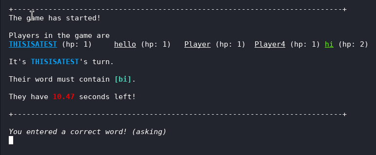

# Word Party
Word Party is an online multiplayer game about guessing words containing a certain substring of 2 or 3 letters. The timer gradually decreases as more players enter correct words, until someone fails to do so and loses a heart. The last player standing is the winner!
This game was inspired by JKLM's Bomb Party.

## Download
[Download here](https://github.com/dxia2p/Word-Party/tags)

## How do I run the game?
Note: This game only works on linux at the moment\
Run `./server` in your terminal followed by `./client`. Enter the IP address of the computer the server is running on and enter "8080" for the port. If you're playing with people over the internet you may need to port forward.

## How its made:

## Lessons Learned
This was my first relatively large project using C
